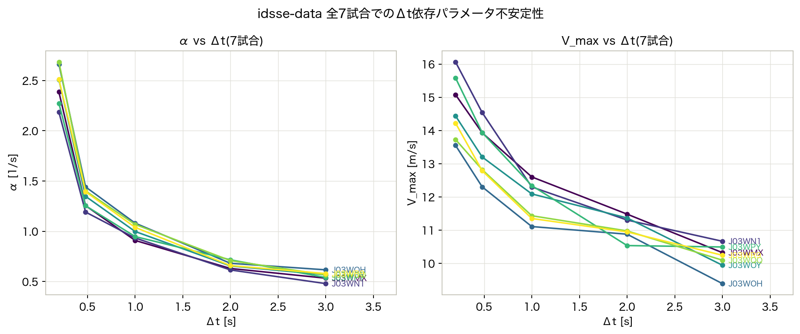
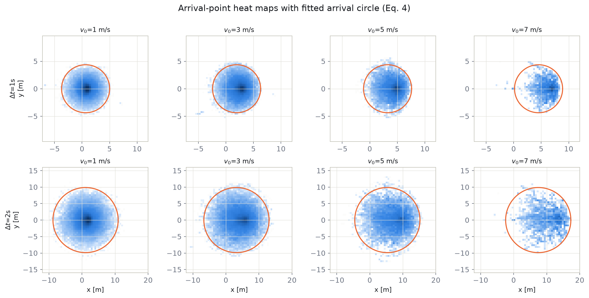
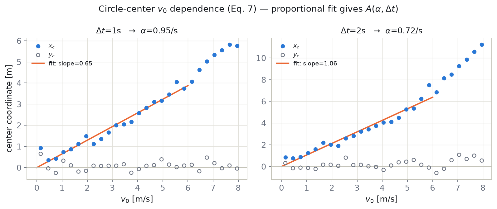
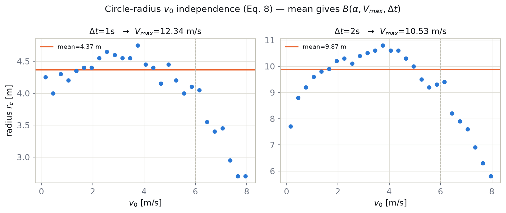
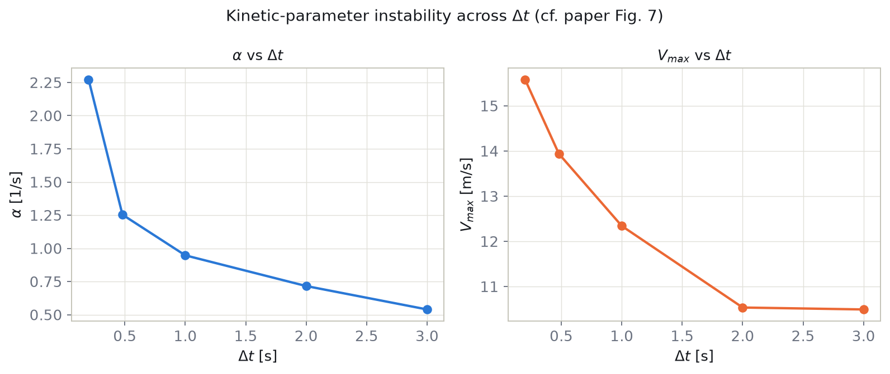

# Phase 1 結果メモ:Baseline再現(藤村・杉原モデルのΔt依存不安定性)

対応するコード: `src/pi_fsm/{data,preprocessing,baseline}.py`, `scripts/phase1_*.py`
参考文献: Narizuka, Takizawa & Yamazaki (2023), *Scientific Reports* 13:865(`documents/Validation_of_a_motion_model.pdf`)

## 目的

研究計画書(`documents/research_plan.md`)フェーズ1の目標である「Narizuka et al. (2023) が発見した $\Delta t$ 依存の不安定性が、idsse-dataでも再現するか(研究前提の確認)」を検証する。

## データ・対象

- データセット: `idsse-data`(独ブンデスリーガ、TRACAB光学トラッキング、25Hz)、`kloppy` 経由でロード
- 対象試合: **全7試合**(`J03WPY, J03WMX, J03WN1, J03WOH, J03WOY, J03WQQ, J03WR9` — `data.py` の `MATCH_IDS`)。図・詳細な回帰診断は `J03WPY` を代表例として掲載
- GK除外後、試合あたり20〜31名(交代選手含む延べ人数)

## 手法(論文の再現)

1. **速度算出**: $\vec{v}(t)$ = 現在位置と1秒前の位置の差分(論文の定義に準拠、フレーム単位の差分ではない)
2. **座標変換**: 各選手・各時刻 $t$ について、原点を選手位置、+x軸を $\vec{v}(t)$ の方向に揃えた座標系に回転
3. **ヒートマップ構築**: $t+\Delta t$ 秒後の到達点を、初速 $v_0$ のビン(幅0.3 m/s)ごとに集計。セルサイズ $0.2\times\Delta t$ m
4. **円フィッティング**(式7,8): ヒートマップ境界から中心 $(x_c,y_c)$ と半径 $r_c$ を推定
5. **パラメータ推定**:
   - $x_c$ vs $v_0$($v_0\le6$ m/s、原点を通る比例フィット)の傾きから $A(\alpha,\Delta t)=(1-e^{-\alpha\Delta t})/\alpha$ を経由して $\alpha$ を数値求解
   - $r_c$ の平均値($v_0\le6$ m/s)から $B(\alpha,V_{max},\Delta t)=V_{max}(\Delta t-A(\alpha,\Delta t))$ を経由して $V_{max}$ を線形に算出

## 結果

### 代表例(`J03WPY`)

| $\Delta t$ 指定 [s] | $\Delta t$ 実際 [s] | $\alpha$ [1/s] | $V_{max}$ [m/s] | 回帰傾き | $r_c$ 平均 [m] |
|---|---|---|---|---|---|
| 0.2 | 0.20 | 2.27 | 15.58 | 0.161 | 0.61 |
| 0.5 | 0.48 | 1.25 | 13.94 | 0.361 | 1.66 |
| 1.0 | 1.00 | 0.95 | 12.34 | 0.646 | 4.37 |
| 2.0 | 2.00 | 0.72 | 10.53 | 1.063 | 9.87 |
| 3.0 | 3.00 | 0.54 | 10.49 | 1.486 | 15.89 |

参考(論文値、J1リーグ54試合平均): $\Delta t=1$s → $\alpha=1.23$, $V_{max}=14.53$ / $\Delta t=2$s → $\alpha=1.04$, $V_{max}=11.19$

### 全7試合(平均・範囲)

| $\Delta t$ 実際 [s] | $\alpha$ 平均 [1/s] | $\alpha$ 範囲 | $V_{max}$ 平均 [m/s] | $V_{max}$ 範囲 |
|---|---|---|---|---|
| 0.20 | 2.46 | 2.19 – 2.68 | 14.67 | 13.55 – 16.06 |
| 0.48 | 1.33 | 1.19 – 1.44 | 13.36 | 12.30 – 14.54 |
| 1.00 | 1.00 | 0.91 – 1.08 | 11.89 | 11.11 – 12.60 |
| 2.00 | 0.67 | 0.62 – 0.72 | 11.07 | 10.53 – 11.48 |
| 3.00 | 0.55 | 0.48 – 0.62 | 10.16 | 9.39 – 10.66 |

生データ: `outputs/phase1_baseline/all_matches_summary.csv`(再現: `scripts/phase1_all_matches.py`)

**$\Delta t=1,2$s では論文値と近いオーダーの値が得られ、かつ $\alpha, V_{max}$ がともに $\Delta t$ とともに単調に減少するという不安定性が、独ブンデスリーガの別データセット・全7試合で一貫して再現された。** 減少は $\Delta t\lesssim1$s で急激、それ以降は緩やかという形状も論文Fig.7と一致。試合間のばらつきは $\alpha$ で±0.1〜0.2程度、$V_{max}$ で±1m/s程度と小さく、**この不安定性が特定の試合固有の現象ではないこと**が確認できた。

図一覧(`outputs/phase1_baseline/`。`report.html` に同内容のまとめあり):

### 到達点ヒートマップ+フィット円(論文Fig.4対応)

$\Delta t$=1,2s × $v_0$=1,3,5,7m/s。密度雲の輪郭とモデルのフィット円がおおむね一致しており、藤村・杉原モデルの「到達可能領域は円形」という予測自体も idsse-data で妥当であることが視覚的に確認できる。

### 円中心の $v_0$ 依存性 → $\alpha$ 推定(論文Fig.5対応)

### 円半径の $v_0$ 独立性 → $V_{max}$ 推定(論文Fig.6対応)

### $\Delta t$ 依存性(論文Fig.7対応)

## 留意点・近似

- ヒートマップの外れ値除去(閾値 $c$、8近傍セルの非空カウントで判定)は論文の記述が曖昧なため、独自の近似実装
- 円中心の回帰は原点を通る比例フィット(切片なし)を採用。理論上妥当だが論文に明記はない
- $v_0>6$ m/s の領域はデータが疎でバイアスが乗る(論文でも同様の指摘あり)、フィットには使用していない
- 7試合は同一シーズン(2022/23 ブンデスリーガ)・同一データ提供元(TRACAB)。別リーグ・別トラッキングベンダーでの再現性は未確認

## 次のステップ(未着手)

- 外れ値除去閾値 $c$ の感度分析
- フェーズ2: PINNによる時間依存 $F(t), k(t)$ の推定実装
