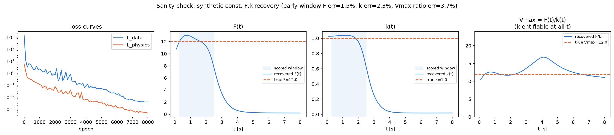
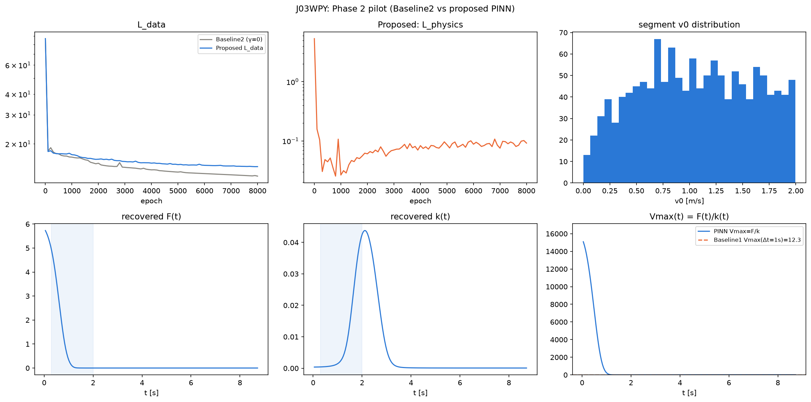
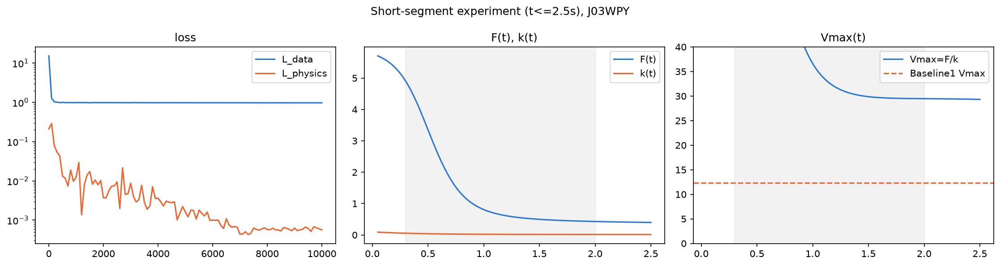

# Phase 2 結果メモ:PINN実装のパイロット学習

対応するコード: `src/pi_fsm/{segments,cache,pinn/models,pinn/loss,pinn/train}.py`, `scripts/phase2_*.py`
計画: `~/.claude/plans/cosmic-giggling-panda.md`(フェーズ2実装計画)

## 目的

フェーズ2実装計画に従い、①PINNパイプライン(スプリント区間抽出→モデル→損失関数→学習ループ)を実装し、②合成データでの正しさの検証(sanity check)、③実データでの小規模パイロット学習、を行う。

## ①スプリント区間抽出(`segments.py`)

`notebooks/02_segment_exploration.ipynb` で試行錯誤し、以下の設計に落ち着いた:

- 開始条件: $v_0<2.0$ m/s から1秒以内に+2.0 m/s以上増加
- **回転基準は $t{=}0$ の瞬間速度ではなく、最初の1秒間の正味の移動方向**を使う(重要な修正 — 詳細は下記)
- 減速カット: ピークからdecel_margin以上・decel_hold_s以上持続して落ちたら打ち切り。**減速で終わらず10秒上限まで到達した区間は破棄**(ジョグ/位置取りの誤検出とみなす)
- 異常値除外: フレーム間速度が12m/sを超える区間は破棄(トラッキングエラー)
- 最小ピーク速度4m/s未満は破棄

**見つけたバグとその修正**: 当初、回転角を $t{=}0$ の瞬間速度ベクトル($v_x(0),v_y(0)$)から計算していたが、区間は必ず低速(<2m/s)から始まるため、この瞬間速度はTRACABの位置誤差(±1m程度)に対して信号が小さく、方向がほぼランダムになる。その結果、実際には数十メートルに及ぶ横方向の「ドリフト」が回転後の y 座標に現れる区間が多数あった(最大70m超)。**最初の1秒間の正味の移動方向**(ノイズに対して相対的に大きい変位)を回転基準にすることで、y方向の中央値が数十mから約1.9mまで改善した。

J03WPY 1試合: **1332区間**、103,754行、$v_0$ は0〜2.0 m/s(区間開始条件により狭い範囲)。

## ②合成データでのsanity check(`scripts/phase2_sanity_check.py`)

既知の定数 $\alpha_{true}=1.0, V_{max,true}=12.0$ から藤村・杉原モデルの解析解(`baseline.A`, `baseline.B`)で合成軌道を200本生成し($v_0\in[0.2,6.0]$、ノイズ±0.03m)、PINNで $F(t),k(t)$ を復元できるか確認した。

**重要な発見(実装上のバグではなく、モデルの構造的性質)**: $F(t), k(t)$ は $t\to0$ 付近でのみ個別に識別可能で、$t$ が大きくなるとどの $v_0$ から出発した軌道も同じ定常速度 $V_{max}$ に収束するため、$v_0$ 間の「速度のばらつき」という識別に必要な信号が消え、**$F(t)/k(t)=V_{max}$ という比のみ**が識別可能になる。これは物理的に妥当な現象で、むしろフェーズ1で「$\Delta t\lesssim1$秒で不安定性が最も強い」と分かったこととも整合する(興味の中心が同じ早期領域にある)。

この性質を踏まえ、$t\in[0.3, 2.5]$s の早期ウィンドウで評価した結果:

| 指標 | 真値 | 復元値 | 相対誤差 |
|---|---|---|---|
| $F$ | 12.00 | 11.82 | 1.5% |
| $k$ | 1.00 | 0.98 | 2.3% |
| $V_{max}=F/k$(全域中央値) | 12.00 | 12.45 | 3.7% |

**PASS**。実装は正しいと判断し、実データに進んだ。

## ③実データでのパイロット学習(`scripts/phase2_pilot_train.py`, J03WPY)

Baseline 2($\gamma=0$、物理制約なしの軌道回帰)と提案手法($\gamma=5$)を、1332区間・103,754行で学習(8000エポック、ローカルMPS、あわせて約14分)。

| 指標 | Baseline 2 | 提案手法 |
|---|---|---|
| 最終 $\mathcal{L}_{data}$ | 12.77 | 14.57 |
| 最終 $\mathcal{L}_{physics}$ | — | 0.092 |

参考: Baseline 1($\Delta t=1$s、フェーズ1)は $\alpha=0.95, V_{max}=12.34$。

### 率直な評価:実データでの定量的な復元はまだ信頼できない

$F(t)/k(t)$ の中央値だけを見ると11.45とBaseline1の12.34に近く、一見良い結果に見える。**しかし実際のカーブを見ると、これは見かけ上の一致に過ぎない**:

- $F(t), k(t)$ はどちらも $t\gtrsim1$秒でほぼ0まで潰れている(合成データのときのような、早期ウィンドウでのフラットな復元にはなっていない)
- $F/k$ の比は $t\to0$ 付近で(ほぼ0除算により)15000近くまで跳ね上がってから急落しており、「中央値が近い」のはこの不安定な挙動の集計結果であって、フラットで信頼できる信号ではない

**考えられる原因**(合成データのsanity checkとの違い):
1. **$v_0$ のレンジが狭い**(実データは0〜2m/s、sanity checkは0〜6m/s)。$v_0$ 間のばらつきが $F,k$ を個別に識別する手がかりであるため、レンジが狭いほど識別が難しくなる
2. **$\mathcal{L}_{data}$ が収束しきっていない**(12.8程度で頭打ち、位置誤差にして平均±2.5〜3m相当)。sanity checkの$\mathcal{L}_{data}\approx0.004$と比べて2桁以上大きく、軌道ネットワークが実データの多様性(区間ごとの個体差・ノイズ)を追いきれていない。$(t,v_0)$のみで条件付ける設計(計画の判断3)により、ある程度の残差は想定内だが、現状はその「想定内の残差」よりまだ大きい可能性がある
3. **学習が足りていない可能性**:学習率を緩やかに減衰させ8000エポックまで伸ばしたところ$\mathcal{L}_{data}$は17.4→12.8まで単調に改善し続けており、収束しきる前に打ち切っている

## 追加実験:$v_0$ レンジを広げてみる(仮説の検証)

上記の原因1(「$v_0$ レンジが狭いことが識別性を下げている」)を検証するため、区間開始条件を緩め($v_{low}$: 2.0→6.0 m/s)、$v_0$ を0〜4.95m/s(Baseline1のフィット範囲 $\le6$m/s に近い)まで広げて同条件で再学習した(1597区間、119,741行、6000エポック)。

**結果: 改善しなかった**。$\mathcal{L}_{data}=14.27$(元の14.57とほぼ同じ)。$V_{max}=F/k$ は評価する $t$ の窓によって0.04〜151.6と大きくばらつき、むしろ安定性は悪化した。

これは重要な否定的結果で、**原因1(識別性)よりも原因2(データへのフィット不足そのもの)が主要なボトルネックである可能性が高い**ことを示唆する。$v_0$ の多様性を増やしても $\mathcal{L}_{data}$ が動かなかったということは、軌道ネットワークが実データの形状自体をまだ捉えきれておらず、そこから計算される加速度(延いては $F,k$)が信頼できるレベルに達していない、という段階だと考えられる。次に手を付けるべきは $v_0$ レンジの拡張ではなく、$\mathcal{L}_{data}$ を収束させること(学習量・ネットワーク容量・学習率スケジュール)だと判断する。

## フィット診断実験:なぜ$\mathcal{L}_{data}$が収束しないのか

容量を増やし(隠れ層64→128、深さ4→5)15000エポック学習したところ $\mathcal{L}_{data}$ は7.4まで改善(訓練不足も要因の一つと確認)。個別の軌道フィットを可視化すると、**短い区間(<2秒)はすでに良くフィットしている一方、長い区間(3秒以上)で系統的に外れる**ことが判明(区間長とper-segment MSEの相関係数0.48)。原因は、$(t,v_0)$ という条件付けだけでは「開始速度が同じでも、その後どれだけ加速し続けるか」という個体差を説明できないため。これは学習不足ではなく、条件付け変数が足りないという構造的な限界。

## 追加実験:区間を短く制限する(t≤2.5秒)

上記の診断を踏まえ、全区間を最初の2.5秒に切り詰めて再学習した(1332区間、76,346行、隠れ層128・深さ5、10000エポック)。この2.5秒という範囲は、sanity checkで$F,k$が識別可能だった早期ウィンドウ、かつフェーズ1で不安定性が最も強かった$\Delta t\lesssim1$秒の領域と重なる。

**結果**:
- $\mathcal{L}_{data}=0.98$(中央値0.047、誤差にしておよそ0.2m)— 大幅に改善(直前の実験の7.4、当初の14.6から)
- $F(t), k(t)$ が初めて滑らかな(振動しない)単調減少カーブになった
- $V_{max}(t)=F(t)/k(t)$ も滑らかに減少し、$t\approx1.5$s以降で約29〜30に収束

**Baseline1($\Delta t=1$s: $V_{max}=12.34$)とは依然として約2.4倍の差がある。** 解釈は2通りありうる:
1. まだ訓練量・identifiabilityに起因するアーティファクト
2. フェーズ1で確認済みの傾向($\Delta t$を短くするほど$V_{max}$が上昇: $\Delta t=3$s→10.5, $\Delta t=1$s→12.3, $\Delta t=0.2$s→15.6)をそのまま $t\to0$ まで延長した、ある程度妥当な値

現時点ではどちらとも判断できない。1回の学習結果のみでは検証不足であり、複数シード・複数試合での再現性確認が必要。

## 結論・次のステップ

- **パイプライン自体(区間抽出→モデル→損失→学習ループ)は正しく動作することを合成データで確認済み**。これがフェーズ2の最重要ゲートであり、達成した
- **実データでは、区間を短く制限する(t≤2.5秒)ことで$\mathcal{L}_{data}$の収束と$F(t),k(t)$の滑らかな復元が大きく前進した**。これが現時点で最も有望な設定
- **$v_0$ レンジの拡張は効果なし、区間長の制限は大きな効果あり**という2つの実験結果から、ボトルネックは識別性よりも「$(t,v_0)$条件付けが長い区間の個体差を表現できないこと」だったと結論づける
- Baseline1との2.4倍のズレの解釈(アーティファクトか、$\Delta t\to0$への妥当な外挿か)は未決着
- 次のステップ:
  - 複数シードでの再現性確認(今の滑らかな結果が偶然でないか)
  - 他の試合でも同じ短区間設定で確認
  - Baseline1側でも$\Delta t<0.2$sのより短い区間の値を計算し、外挿の傾向と整合するか照合
  - 全7試合・本番規模の学習はColabへ(計画通り)
