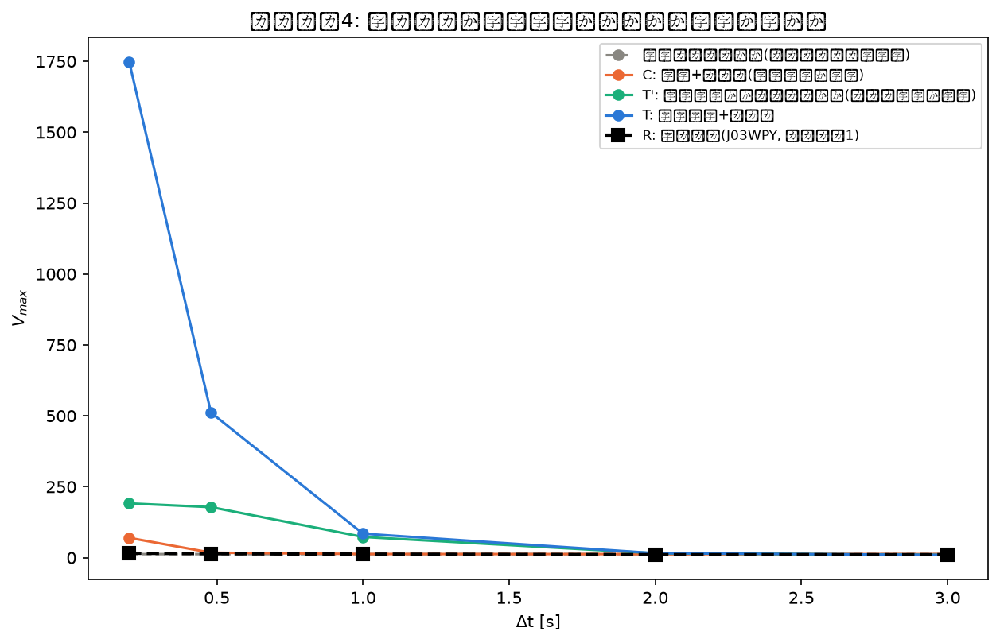
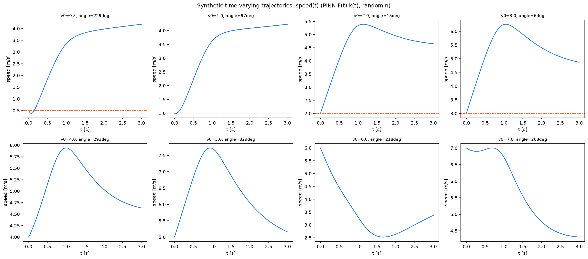

# Phase 4 結果メモ:合成データでのリカバリーテスト(測定誤差 vs モデルの限界)

対応するコード: `scripts/phase4_synthetic_recovery.py`, `scripts/phase4_diagnose_trajectories.py`

## TL;DR(2026-08-13時点、初回実装)

**目的**: 研究の核心的な問い②「$\Delta t$不安定性の原因は測定誤差(TRACAB±1m)か、モデルの限界(本当に$F,k$が時間変化している)か」に答える。`documents/phase2_pilot_results.md`参照。

**やったこと**: 4条件の合成データ実験を実装・実行
1. 定数($\alpha=0.947,V_{max}=12.34$、J03WPYの$\Delta t=1$sフィット)・ノイズなし
2. 定数・ノイズあり(±1m, C: 測定誤差の指紋)
3. 時間変化(PINNが復元した$F(t),k(t)$)・ノイズなし(T': モデルの限界の指紋)
4. 時間変化・ノイズあり(T)

いずれも、選手ごとに駆動力の方向$n$をランダムに割り振って藤村・杉原モデルの運動方程式を数値積分し(オイラー法、$dt=0.002$s)、フェーズ1と同じBaseline1の推定手順($v_0$ビンごとの円フィット→回帰)にかけた。ただしヒートマップの外れ値除去は密なノイズを前提としているため機能せず、ビンごとの単純平均に基づく代替の推定関数(`estimate_kinetic_parameters_meanbased`)を実装して使用。

**結果**:
- **条件①(定数・ノイズなし)は正しく動作**: $\alpha=0.94$〜$0.95$, $V_{max}=12.39$〜$12.42$ と真値に近く、$\Delta t$によらずほぼフラット。パイプラインの正しさを確認
- **条件②(定数+ノイズ)**: 短い$\Delta t$(0.2s)で$V_{max}=69.7$という、実データ(15.6)よりずっと極端な不安定性が出た
- **条件③④(時間変化)**: $\alpha$が$\Delta t=0.2$で0.02程度と極端に小さい値からスタートし、$\Delta t=3$で0.32まで増加するという、実データ(2.27→0.54と減少)とは逆方向のパターンになった

**この結果はまだ結論に使えない。2つの理由**:
1. **サンプル数の不一致**: 合成データは20万サンプル、実データは数百万フレーム相当。条件②の極端な不安定性は、この差によりノイズの影響を過大評価している可能性が高い
2. **PINNの$k(t)$の形の未検証性**: 診断の結果、条件③④の異常な挙動はバグではなく、PINNが復元した$k(t)$が$t\approx0.5〜1.5$秒で0.045→0.75と急激に立ち上がる、その形をそのまま反映したものと判明(`scripts/phase4_diagnose_trajectories.py`で個別軌道を可視化し、積分自体は物理的に妥当と確認済み)。しかしこの急な立ち上がりが本物の生理現象か、学習の癖(正則化の強さ等)による人工物かは、まだ独立に検証していない

**次にやるべきこと**:
1. 合成データのサンプル数を実データの規模に近づけ、条件②(測定誤差の指紋)の見積もりを補正する
2. PINNの$k(t)$の急な立ち上がりが、他の試合でも一貫して出るか確認する(`scripts/phase2_generalization_check.py`等の複数試合インフラを流用可能)
3. 上記2点が解決してから、条件①〜④と実データ(R)を比較し、測定誤差 vs モデルの限界の判定を行う

## 詳細

### PINN学習(時間変化条件の元になった$F(t),k(t)$)

J03WPY、$t\le2.5$s、隠れ層128・深さ5、$\beta=0.01$(正則化)、seed=0、10000エポック。$\mathcal{L}_{data}=0.990$。

| $t$ [s] | $F(t)$ | $k(t)$ |
|---|---|---|
| 0.05 | 4.40 | 0.026 |
| 0.5 | 4.02 | 0.045 |
| 1.0 | 3.54 | 0.503 |
| 1.5 | 3.31 | 0.745 |
| 2.0 | 3.22 | 0.750 |
| 2.5 | 3.19 | 0.731 |

### 4条件のBaseline1推定結果

| 条件 | $\Delta t=0.2$ | $\Delta t=0.48$ | $\Delta t=1.0$ | $\Delta t=2.0$ | $\Delta t=3.0$ |
|---|---|---|---|---|---|
| ①定数・ノイズなし($\alpha$) | 0.953 | 0.947 | 0.945 | 0.942 | 0.939 |
| ①定数・ノイズなし($V_{max}$) | 12.42 | 12.40 | 12.40 | 12.39 | 12.39 |
| ②定数+ノイズ($V_{max}$) | **69.72** | 17.51 | 12.74 | 12.43 | 12.41 |
| ③時間変化・ノイズなし($\alpha$) | 0.023 | 0.025 | 0.057 | 0.225 | 0.325 |
| ③時間変化・ノイズなし($V_{max}$) | 191.3 | 178.0 | 72.8 | 15.4 | 9.4 |
| ④時間変化+ノイズ($V_{max}$) | 1748.8 | 511.1 | 84.4 | 15.6 | 9.4 |
| 参考: 実データR($V_{max}$、フェーズ1) | 15.58 | 13.94 | 12.34 | 10.53 | 10.49 |



### 軌道の診断(バグでないことの確認)

`scripts/phase4_diagnose_trajectories.py` で、$v_0=0.5〜7$m/s・方向ランダムな8本の個別軌道を可視化。速度プロファイルはいずれも滑らかで、方向によっては最初に減速してから再加速するなど、物理的に妥当な挙動を示した。積分コード自体にバグはないと判断。



## 使い方

```bash
uv run python scripts/phase4_synthetic_recovery.py       # 本実験(PINN学習込み、ローカルで約8分)
uv run python scripts/phase4_diagnose_trajectories.py    # 個別軌道の診断可視化
```
