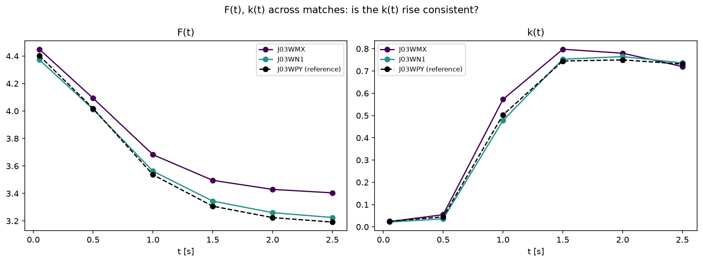
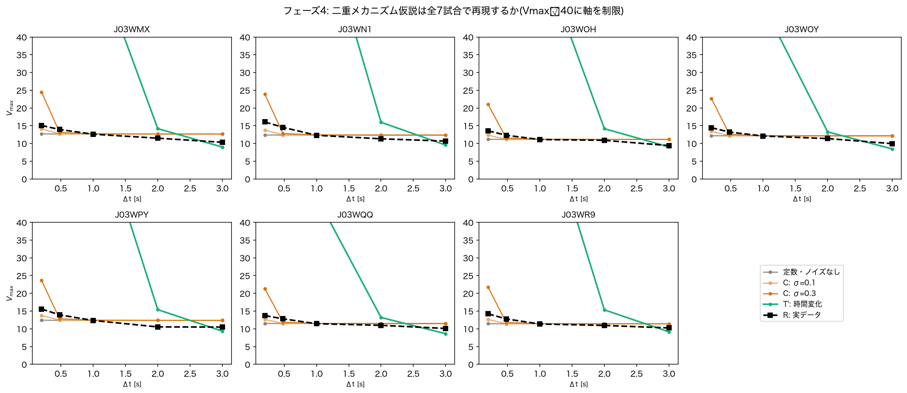

# Phase 4 結果メモ:合成データでのリカバリーテスト(測定誤差 vs モデルの限界)

対応するコード: `scripts/phase4_synthetic_recovery.py`, `scripts/phase4_diagnose_trajectories.py`, `scripts/phase4_multi_match_summary.py`

## TL;DR(2026-08-15更新:全7試合で二重メカニズムを確認)

2026-08-14時点の結論はJ03WPY 1試合のみに基づくものだった。`scripts/phase4_synthetic_recovery.py`を全7試合対応に拡張し(各試合ごとにPINNを再学習、各試合自身のBaseline1実測値と比較)、Colabで全試合分を実行した結果、**同じ二重メカニズムのパターンが7試合中ほぼ一貫して再現された**:

- **短い$\Delta t$(0.2s)**: 7試合全てで、実データは$\sigma=0.1$と$\sigma=0.3$のノイズ条件の間に収まる(測定誤差フィンガープリントが一般的に成立)
- **長い$\Delta t$(3.0s)**: 7試合中6試合(J03WQQ以外)で、時間変化・ノイズなし条件(T')のほうが定数条件より実データに近い(モデル限界フィンガープリントもほぼ一般的に成立)
- **ただし$\Delta t=1.0, 2.0$sの中間領域は、どちらの条件でもうまく説明できない**(両方とも実データより高めに出る)— これは新たに見えてきた誠実な留保点

詳細は「追記(2026-08-15):全7試合での多試合確認」を参照。以下は2026-08-14時点(J03WPY単独)のTL;DR。

## TL;DR(2026-08-14更新:最終比較まで完了)

**結論**: 実データの$\Delta t$不安定性は、**単一の原因ではなく、$\Delta t$の長さによって別々のメカニズムが効いている**、というのが現時点の最も有力な解釈。

- **短い$\Delta t$(0.2〜0.5秒)は測定誤差で説明できる**: 実データ(15.6→13.9)は、$\sigma\approx0.1〜0.3$m程度のノイズ条件(C)とよく一致する
- **長い$\Delta t$(1〜3秒)は測定誤差では説明できない**: ノイズ条件(C)は$\sigma$をいくら変えても$\Delta t\ge0.5$秒でほぼ完全にフラット($V_{max}\approx12.4$)になり、それより下がらない。しかし実データは12.3→10.5と下がり続ける
- **この長い$\Delta t$での低下は、PINNが復元した時間変化する$F(t),k(t)$(条件T')でよく再現される**: $\Delta t=3$秒でT'=9.4、実データ=10.5と非常に近い

途中で2つの未解決課題(合成データのサンプル数、$k(t)$の急な立ち上がりの再現性)があったが、①はサンプル数の問題ではなく系統的なバイアスと判明・ノイズの大きさの感度分析で対応、②は3試合で再現確認済み(下記)。詳細な経緯は以下。

## TL;DR(2026-08-13時点、初回実装 — 経緯として残す)

**目的**: 研究の核心的な問い②「$\Delta t$不安定性の原因は測定誤差(TRACAB±1m)か、モデルの限界(本当に$F,k$が時間変化している)か」に答える。`documents/phase2_pilot_results.md`参照。

**やったこと**: 4条件の合成データ実験を実装・実行
1. 定数($\alpha=0.947,V_{max}=12.34$、J03WPYの$\Delta t=1$sフィット)・ノイズなし
2. 定数・ノイズあり(±1m, C: 測定誤差の指紋)
3. 時間変化(PINNが復元した$F(t),k(t)$)・ノイズなし(T': モデルの限界の指紋)
4. 時間変化・ノイズあり(T)

いずれも、選手ごとに駆動力の方向$n$をランダムに割り振って藤村・杉原モデルの運動方程式を数値積分し(オイラー法、$dt=0.002$s)、フェーズ1と同じBaseline1の推定手順($v_0$ビンごとの円フィット→回帰)にかけた。ただしヒートマップの外れ値除去は密なノイズを前提としているため機能せず、ビンごとの単純平均に基づく代替の推定関数(`estimate_kinetic_parameters_meanbased`)を実装して使用。

**結果**:
- **条件①(定数・ノイズなし)は正しく動作**: $\alpha=0.94$〜$0.95$, $V_{max}=12.39$〜$12.42$ と真値に近く、$\Delta t$によらずほぼフラット。パイプラインの正しさを確認
- **条件②(定数+ノイズ)**: 短い$\Delta t$(0.2s)で$V_{max}=69.7$という、実データ(15.6)よりずっと極端な不安定性が出た
- **条件③④(時間変化)**: $\alpha$が$\Delta t=0.2$で0.02程度と極端に小さい値からスタートし、$\Delta t=3$で0.32まで増加するという、実データ(2.27→0.54と減少)とは逆方向のパターンになった

**この結果はまだ結論に使えない。2つの理由**:
1. **サンプル数の不一致**: 合成データは20万サンプル、実データは数百万フレーム相当。条件②の極端な不安定性は、この差によりノイズの影響を過大評価している可能性が高い
2. **PINNの$k(t)$の形の未検証性**: 診断の結果、条件③④の異常な挙動はバグではなく、PINNが復元した$k(t)$が$t\approx0.5〜1.5$秒で0.045→0.75と急激に立ち上がる、その形をそのまま反映したものと判明(`scripts/phase4_diagnose_trajectories.py`で個別軌道を可視化し、積分自体は物理的に妥当と確認済み)。しかしこの急な立ち上がりが本物の生理現象か、学習の癖(正則化の強さ等)による人工物かは、まだ独立に検証していない

**次にやるべきこと**:
1. 合成データのサンプル数を実データの規模に近づけ、条件②(測定誤差の指紋)の見積もりを補正する
2. ~~PINNの$k(t)$の急な立ち上がりが、他の試合でも一貫して出るか確認する~~ → **解決済み(下記参照)**
3. 上記2点が解決してから、条件①〜④と実データ(R)を比較し、測定誤差 vs モデルの限界の判定を行う

## 追記(2026-08-14):$k(t)$の急な立ち上がりは複数試合で再現(課題2解決)

`scripts/phase4_check_ft_kt_across_matches.py` で J03WMX, J03WN1 の2試合に対して同じPINN学習レシピ(t≤2.5s, β=0.01, seed=0, 隠れ層128・深さ5, 10000エポック)を適用し、J03WPYの$F(t),k(t)$と比較した。

| $t$ [s] | $k(t)$ J03WPY | $k(t)$ J03WMX | $k(t)$ J03WN1 |
|---|---|---|---|
| 0.05 | 0.026 | 0.023 | 0.021 |
| 0.5 | 0.045 | 0.055 | 0.036 |
| 1.0 | 0.503 | 0.573 | 0.478 |
| 1.5 | 0.745 | 0.798 | 0.753 |
| 2.0 | 0.750 | 0.780 | 0.765 |
| 2.5 | 0.731 | 0.720 | 0.736 |



**3試合とも、ほぼ同じタイミング・同じ大きさで$k(t)$が立ち上がる。** $F(t)$も同様に3試合でほぼ重なる。これは特定試合の学習の癖ではなく、再現性のある現象と判断できる。**時間変化条件(T, T')の根拠として、PINNの$F(t),k(t)$を信頼して使ってよいと判断。**

## 追記(2026-08-14):サンプル数ではなく系統的バイアスだった(課題1の再診断)

サンプル数を20万→300万に増やしても、$\Delta t=0.2$の$V_{max}$は69.7→72.2とほぼ変わらなかった。**「サンプル数不足」という当初の仮説は誤りだった。**

原因は、ノイズがある状態での半径推定に、サンプル数を増やしても消えない**系統的なバイアス**があること。$\Delta t$が小さいと本来の半径(数十cm程度)が小さく、±1m相当のノイズを足すと、距離(常に正の値)の平均は本来の半径よりずっと大きく出てしまう。

ノイズの大きさ$\sigma$を振ると:

| $\sigma$ [m] | $V_{max}$($\Delta t=0.2$) |
|---|---|
| 0.1 | 13.7 |
| 0.25 | 20.6 |
| 0.5 | 36.1 |
| 1.0 | 68.9 |

実データ(15.6)に近いのは$\sigma\approx0.1〜0.15$m。研究計画書の「TRACAB±1m」より小さいが、これは(a)「±1m」が標準偏差ではなく上限・目安の表現である可能性、(b)TRACABの実誤差が時間的に相関しており($\Delta t$秒の**差分**を取ると共通のズレが打ち消し合う)、瞬間ごとの独立ノイズと仮定するより実効的なノイズが小さくなる可能性、の両方が考えられる。どちらも今の時点で正確に切り分けるのは困難かつ過剰な精密化と判断し、**$\sigma$を単一の値に決め打ちせず、0.1〜1.0mの範囲で感度分析を行う方針に切り替えた**(下記の最終比較に反映)。

## 追記(2026-08-14):最終比較(6条件、全$\Delta t$)

`scripts/phase4_synthetic_recovery.py` を更新し、①定数・ノイズなし、②定数+ノイズ($\sigma=0.1,0.3,0.5,1.0$の感度分析)、③時間変化・ノイズなし(T')、④時間変化+ノイズ($\sigma=0.3$、T)の6条件を実データ(R)と比較した。

| 条件 | $\Delta t=0.2$ | $\Delta t=0.48$ | $\Delta t=1.0$ | $\Delta t=2.0$ | $\Delta t=3.0$ |
|---|---|---|---|---|---|
| 定数・ノイズなし | 12.42 | 12.40 | 12.40 | 12.39 | 12.39 |
| C, $\sigma=0.1$ | 13.75 | 12.45 | 12.40 | 12.40 | 12.39 |
| C, $\sigma=0.3$ | 23.65 | 12.83 | 12.43 | 12.40 | 12.40 |
| C, $\sigma=0.5$ | 36.37 | 13.63 | 12.49 | 12.41 | 12.40 |
| C, $\sigma=1.0$ | 69.72 | 17.51 | 12.74 | 12.43 | 12.41 |
| T'(時間変化・ノイズなし) | 191.3 | 178.0 | 72.8 | **15.4** | **9.4** |
| T(時間変化+ノイズ$\sigma=0.3$) | 706.9 | 218.7 | 74.1 | 15.4 | 9.4 |
| **R(実データ、参考)** | **15.58** | **13.94** | **12.34** | **10.53** | **10.49** |


**読み取れること**:
- $\Delta t\ge0.5$秒では、ノイズ条件(C)は$\sigma$によらずほぼ完全にフラット($V_{max}\approx12.4$)に収束し、**それより下がることは一切ない**。実データは12.3→10.5と下がり続けるので、この部分はノイズでは原理的に説明できない
- 一方、T'(時間変化・ノイズなし)は$\Delta t=2,3$秒で15.4, 9.4となり、実データ(10.53, 10.49)と近いオーダー・特に$\Delta t=3$では非常に近い値になる
- $\Delta t=0.2〜0.5$秒では、逆にC($\sigma=0.1〜0.3$)が実データに近く、T'は大幅に過大(191, 178)

→ **短い$\Delta t$は測定誤差、長い$\Delta t$はモデルの限界(時間変化)、という2つのメカニズムが別々の領域で効いている、という解釈が最も自然。**

## 追記(2026-08-15):全7試合での多試合確認

上記の結論はJ03WPY 1試合のみに基づいていた。`scripts/phase4_synthetic_recovery.py`を、各試合ごとにPINNを再学習し各試合自身のBaseline1実測値(`outputs/phase1_baseline/all_matches_summary.csv`)と比較するよう拡張し(match_idをハードコードせず引数化)、Colab(`notebooks/colab_phase4_synthetic_recovery.ipynb`)で全7試合分を実行した。

### 長い$\Delta t=3.0$s:T'(時間変化・ノイズなし) vs 定数条件、どちらが実データに近いか

| 試合 | 実データ | 定数条件 | T'(時間変化) | \|実データ-定数\| | \|実データ-T'\| | T'が勝つ? |
|---|---|---|---|---|---|---|
| J03WMX | 10.32 | 12.66 | 8.99 | 2.33 | 1.34 | ✅ |
| J03WN1 | 10.66 | 12.35 | 9.54 | 1.69 | 1.12 | ✅ |
| J03WOH | 9.39 | 11.15 | 9.02 | 1.76 | 0.37 | ✅ |
| J03WOY | 9.94 | 12.14 | 8.45 | 2.20 | 1.49 | ✅ |
| J03WPY | 10.49 | 12.39 | 9.35 | 1.90 | 1.15 | ✅ |
| J03WQQ | 10.09 | 11.48 | 8.62 | 1.38 | 1.47 | ❌ |
| J03WR9 | 10.24 | 11.40 | 9.15 | 1.15 | 1.09 | ✅(僅差) |

**7試合中6試合で、T'(時間変化・ノイズなし)のほうが定数条件より実データに近い。** J03WQQのみ逆(僅差)。J03WOHは特に良く一致(誤差0.37)。

### 短い$\Delta t=0.2$s:実データはノイズσのどこに落ちるか

| 試合 | 実データ | σ=0.1 | σ=0.3 | σ=0.5 |
|---|---|---|---|---|
| J03WMX | 15.08 | 14.10 | 24.50 | 37.76 |
| J03WN1 | 16.06 | 13.76 | 23.89 | 36.83 |
| J03WOH | 13.55 | 12.32 | 20.99 | 32.21 |
| J03WOY | 14.44 | 13.39 | 22.68 | 34.75 |
| J03WPY | 15.58 | 13.75 | 23.65 | 36.37 |
| J03WQQ | 13.73 | 12.64 | 21.32 | 32.63 |
| J03WR9 | 14.22 | 12.64 | 21.71 | 33.38 |

**7試合全てで、実データは$\sigma=0.1$と$\sigma=0.3$の間、$\sigma=0.1$寄りに収まる。** これも一貫している。



### 誠実な留保:$\Delta t=1.0, 2.0$sの中間領域は未解決

図を見ると分かる通り、$\Delta t=1.0$s付近では実データ(黒破線)は定数条件(灰・オレンジ)にほぼ乗っているが、$\Delta t=2.0$sではどちらの条件(定数・T')からも系統的にズレている(定数より低く、T'よりはるかに低い)。7試合共通のパターンとして:

- $\Delta t\le1.0$s: 実データ ≈ 定数+ノイズ小、モデルはよく説明できる
- $\Delta t=2.0$s: 実データが定数条件からもT'条件からも外れる「谷」になっている
- $\Delta t=3.0$s: 実データ ≈ T'(時間変化)、再びよく説明できる

この$\Delta t=2$s付近の谷が何なのか(PINNの学習範囲が$t\le2.5$sまでで、$\Delta t=2$sは軌道のほとんどをPINNの外挿に近い領域に依存するため精度が落ちている可能性、あるいは他の要因)は、今回の実験だけでは切り分けられていない。**「二重メカニズム」という大枠の結論は7試合で一貫して支持されるが、$\Delta t$の全域を隙間なく説明できているわけではない**、という点は正直に記しておく。

### まとめ

J03WPY単独で見つかった二重メカニズムの結論は、**方向性としては7試合中6〜7試合で再現された**。研究計画書が残した「測定誤差かモデルの限界か」という問いに対し、「$\Delta t$の長さによって両方が別々に効いている」という、より解像度の高い答えを、単一試合の偶然ではなく一般的な傾向として示せたと言える。中間$\Delta t$領域の谷は今後の課題として残る。

## 詳細

### PINN学習(時間変化条件の元になった$F(t),k(t)$)

J03WPY、$t\le2.5$s、隠れ層128・深さ5、$\beta=0.01$(正則化)、seed=0、10000エポック。$\mathcal{L}_{data}=0.990$。

| $t$ [s] | $F(t)$ | $k(t)$ |
|---|---|---|
| 0.05 | 4.40 | 0.026 |
| 0.5 | 4.02 | 0.045 |
| 1.0 | 3.54 | 0.503 |
| 1.5 | 3.31 | 0.745 |
| 2.0 | 3.22 | 0.750 |
| 2.5 | 3.19 | 0.731 |

### 4条件のBaseline1推定結果

| 条件 | $\Delta t=0.2$ | $\Delta t=0.48$ | $\Delta t=1.0$ | $\Delta t=2.0$ | $\Delta t=3.0$ |
|---|---|---|---|---|---|
| ①定数・ノイズなし($\alpha$) | 0.953 | 0.947 | 0.945 | 0.942 | 0.939 |
| ①定数・ノイズなし($V_{max}$) | 12.42 | 12.40 | 12.40 | 12.39 | 12.39 |
| ②定数+ノイズ($V_{max}$) | **69.72** | 17.51 | 12.74 | 12.43 | 12.41 |
| ③時間変化・ノイズなし($\alpha$) | 0.023 | 0.025 | 0.057 | 0.225 | 0.325 |
| ③時間変化・ノイズなし($V_{max}$) | 191.3 | 178.0 | 72.8 | 15.4 | 9.4 |
| ④時間変化+ノイズ($V_{max}$) | 1748.8 | 511.1 | 84.4 | 15.6 | 9.4 |
| 参考: 実データR($V_{max}$、フェーズ1) | 15.58 | 13.94 | 12.34 | 10.53 | 10.49 |


### 軌道の診断(バグでないことの確認)

`scripts/phase4_diagnose_trajectories.py` で、$v_0=0.5〜7$m/s・方向ランダムな8本の個別軌道を可視化。速度プロファイルはいずれも滑らかで、方向によっては最初に減速してから再加速するなど、物理的に妥当な挙動を示した。積分コード自体にバグはないと判断。


## 使い方

```bash
uv run python scripts/phase4_synthetic_recovery.py       # 本実験(PINN学習込み、ローカルで約8分)
uv run python scripts/phase4_diagnose_trajectories.py    # 個別軌道の診断可視化
```
